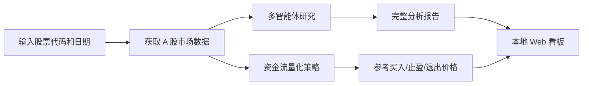

# TnT Stock Analysis with EQS

面向中国 A 股的本地股票研究与量化策略观察工具。项目将多智能体研究、A 股行情与资金流、中文市场新闻、财务数据和本地 Web 看板整合为一套可重复运行的分析流程。

本项目用于研究和策略验证，不连接券商，不会自动提交真实交易订单，也不构成投资建议。

## 项目特点

- 使用 Tushare 和 AKShare 获取 A 股日线、资金流、技术指标与财务数据。
- 接入财联社、同花顺等中文资讯，减少只依赖海外新闻源造成的信息偏差。
- 通过行情、新闻、基本面、情绪、研究辩论和风险管理生成完整股票报告。
- 提供独立的 A 股资金流量化策略，输出参考买入价、止盈价和风险退出价。
- 提供本地 Web 看板，集中查看历史报告、量化信号、财务趋势、估值和抓取日志。
- 支持 OpenAI、Qwen、DeepSeek、Gemini、Claude、GLM、MiniMax M3、OpenRouter 和 Ollama 等模型服务。
- 支持 Apple Silicon macOS、Windows 和 Linux。

## 我的主要改进

本仓库在 TradingAgents 多智能体框架基础上，重点完成了以下 A 股本地化工作：

1. 增加 Tushare、AKShare 数据适配和故障回退，统一处理 `.SH`、`.SS`、`.SZ` 与 `.BJ` 股票代码。
2. 增加中文市场新闻获取与股票相关性筛选，并减少无关海外论坛数据对 A 股分析的影响。
3. 增加 Tushare 财务报表、财务质量、估值指标和趋势快照。
4. 实现基于资金净流入的 A 股量化策略和独立策略报告。
5. 实现无需 Node.js 的本地 Web 看板及报告、量化、财务 API。
6. 增强无数据处理、行情校验、环境变量配置、跨平台兼容和自动化测试。
7. 增加 MiniMax 全球区/中国区支持，并加入 `MiniMax-M3` 模型选择与请求兼容处理。

## 工作流程



## 环境要求

- Python 3.10 或更高版本
- Git
- 至少一个受支持的 LLM API Key，或可访问的 Ollama 服务
- 分析 A 股时建议准备 Tushare Token
- 可访问对应模型和数据服务的网络环境

## 安装

### macOS ARM64（Apple Silicon）

以下方式适用于 M1、M2、M3、M4 等 Apple Silicon 设备。建议使用 ARM 原生 Homebrew 和 Python，不要在 Rosetta 终端中混装 x86 依赖。

```bash
xcode-select --install
brew install git python

git clone https://github.com/SkyPiggy8/TnT_stock_analysis_with_EQS.git
cd TnT_stock_analysis_with_EQS

python3 -m venv .venv
source .venv/bin/activate
python -m pip install --upgrade pip
python -m pip install .
```

确认 Python 架构：

```bash
uname -m
python -c "import platform; print(platform.machine())"
```

两条命令都应输出 `arm64`。

### Windows 10/11（PowerShell）

先安装 Git for Windows 和 Python 3.10 或更高版本。安装 Python 时勾选 **Add Python to PATH**。

```powershell
git clone https://github.com/SkyPiggy8/TnT_stock_analysis_with_EQS.git
Set-Location TnT_stock_analysis_with_EQS

py -3 -m venv .venv
Set-ExecutionPolicy -Scope Process -ExecutionPolicy Bypass
.\.venv\Scripts\Activate.ps1
python -m pip install --upgrade pip
python -m pip install .
```

`Set-ExecutionPolicy -Scope Process` 只影响当前 PowerShell 会话。

### Linux（Ubuntu/Debian）

```bash
sudo apt update
sudo apt install -y git python3 python3-venv python3-pip

git clone https://github.com/SkyPiggy8/TnT_stock_analysis_with_EQS.git
cd TnT_stock_analysis_with_EQS

python3 -m venv .venv
source .venv/bin/activate
python -m pip install --upgrade pip
python -m pip install .
```

### Docker

创建 `.env` 后，也可以使用 Docker Compose：

```bash
docker compose run --rm tradingagents
```

使用本地 Ollama：

```bash
docker compose --profile ollama run --rm tradingagents-ollama
```

## 配置

在仓库根目录创建 `.env`。只填写实际使用的服务，至少配置一个模型 API Key；使用 A 股数据时配置 `TUSHARE_TOKEN`。

```dotenv
# 选择一个模型服务
OPENAI_API_KEY=your_openai_api_key
# DASHSCOPE_CN_API_KEY=your_qwen_api_key
# DEEPSEEK_API_KEY=your_deepseek_api_key
# GOOGLE_API_KEY=your_google_api_key
# ANTHROPIC_API_KEY=your_anthropic_api_key

# MiniMax 国际区与中国区使用不同账号和密钥
# MINIMAX_API_KEY=your_global_minimax_key
# MINIMAX_CN_API_KEY=your_china_minimax_key

# A 股数据
TUSHARE_TOKEN=your_tushare_token

# 推荐的数据源优先级
TRADINGAGENTS_CORE_STOCK_VENDOR=tushare,akshare
TRADINGAGENTS_TECHNICAL_INDICATORS_VENDOR=tushare,akshare
TRADINGAGENTS_FUNDAMENTAL_DATA_VENDOR=tushare,yfinance
TRADINGAGENTS_NEWS_DATA_VENDOR=akshare_news,yfinance
```

`.env` 已被 Git 忽略。不要将真实 Token、API Key 或其他凭据提交到仓库。

### MiniMax M3

在 CLI 中选择 MiniMax 后，需要选择密钥所属区域：

- `Global — api.minimax.io` 使用 `MINIMAX_API_KEY`。
- `China — api.minimaxi.com` 使用 `MINIMAX_CN_API_KEY`。

两个区域的账号和密钥不能互换。快速模型和深度模型菜单均可选择 `MiniMax-M3`，模型 ID 区分大小写。

## 运行股票分析

激活虚拟环境并在仓库根目录运行：

```bash
python -m cli.main
```

也可以使用安装后的命令：

```bash
tradingagents
```

按照终端提示选择：

1. 股票代码，例如上海股票 `600519.SH`、深圳股票 `000001.SZ`。
2. 分析日期。
3. 报告语言。
4. LLM 服务商、区域和模型。
5. 分析角色与研究深度。
6. 分析完成后保存报告。

报告默认保存在：

```text
reports/股票代码_时间/
```

主要文件：

| 文件 | 内容 |
|---|---|
| `complete_report.md` | 行情、新闻、基本面、研究辩论、交易判断和风险结论 |
| `quant_strategy_report.md` | 资金流信号、参考价格、止盈线和风险退出线 |
| `data_fetch.log` | 数据来源、获取状态和必要的错误信息 |

## 量化策略使用方法

量化策略的定位是提示入场和退场时机，不包含实时买入、卖出或任何券商操作。它使用日线、资金流、复权因子和相对估值数据生成研究参考：

1. 计算过去 20 个交易日平均成交额，并统计最近 3 日累计资金净流入。
2. 最近 3 日至少有 2 日净流入，资金流强度达到 3%，成交额没有萎缩，收盘价位于 MA20 上方，且当日涨跌幅未达到追高过滤线时，记录 `Day 0`。
3. `Day 0` 收盘后才能确认信号，因此不会把 `Day 0 close` 当成已成交价格；参考入场价使用下一交易日开盘价并计入滑点。
4. 使用股票自身历史 PE(TTM) 和 PB 中位数估算相对合理价值，加入 10% 安全边际，再与 ATR 和信号价格共同生成“建议买入区间”。这不是 DCF 绝对估值，估值数据不足时会明确降级为纯技术区间。
5. 初始风控距离使用 2 ATR，并限制在入场价的 3% 至 15%；止盈价使用 2R 收益风险比。
6. 持有期间逐日检查 High/Low。达到新高后使用“峰值收盘价减 2.5 ATR”上移退场线，避免价格回落后重新显示为持有。
7. 信号超过 30 个自然日仍未退出时，提示按当前可成交价格退出并重新评估。
8. 价格历史优先使用 `adj_factor` 前复权；没有复权数据时报告会提示人工检查分红送转。
9. 同一时间只保留一个观察仓位，持有期间的新信号不会重置入场价和风控线。
10. 报告提供当前股票回看窗口内的非重叠交易摘要，并给出每 10 万元资金、单笔风险 1%、仓位上限 20% 的模拟股数。该结果只用于风险尺度展示。

报告会明确给出：

| 字段 | 含义 |
|---|---|
| `Suggested entry zone` | 基本面相对估值、安全边际和 ATR 共同约束的建议买入区间 |
| `Reference entry price` | T+1 开盘价加模拟滑点，仅用于策略观察 |
| `Take-profit level` | 依据实际参考入场价和 2R 计算的止盈线 |
| `Risk-exit level` | 建仓时的初始 ATR 风控线 |
| `Current exit trigger` | 随价格与 ATR 更新的当前动态退场线 |
| `Suggested exit price now` | 当前规则下应重点观察的退场价格或已记录的退出估计价 |
| `Example position limit` | 按示例资金和风险预算计算的研究型仓位上限，不会创建订单 |

信号解释：

| 信号 | 含义 |
|---|---|
| `DATA_UNAVAILABLE` | 数据、权限、Token 或网络不可用 |
| `NO_BUY_SIGNAL` | 没有同时通过资金流、趋势、流动性和追高过滤 |
| `PENDING_ENTRY` | Day 0 已确认，等待下一交易日可成交价格 |
| `WAIT_FOR_ENTRY_PRICE` | 资金流条件已出现，但当前价格高于基本面与 ATR 共同约束的买入上限 |
| `ENTRY_BLOCKED_LIMIT_UP` | 下一交易日开盘接近涨停，模拟为无法入场 |
| `FUNDAMENTAL_REVIEW_REQUIRED` | 政策或基本面出现重大变化，暂停新增入场并人工复核 |
| `ACTIVE_HOLD_MONITOR` | 已按 T+1 建立观察仓位，仅继续监控退场条件，不代表当前继续买入 |
| `SELL_TAKE_PROFIT` | 持有期间价格已触及止盈线 |
| `REDUCE_OR_EXIT` | 持有期间价格已触及动态风控线 |
| `EXPIRED` | Day 0 已超过 30 个自然日，提示退出并重新评估 |

同一根日线同时触及止损和止盈时，因为无法知道盘中先后顺序，策略采用保守规则，假设止损先发生。所有价格均为研究参考，不等于实际成交价格。

报告中的 `Lookback Backtest Snapshot` 只是当前单只股票、当前回看窗口的样本内诊断，不代表全市场样本外有效性。正式使用前仍应针对包含退市、ST、停牌股票的历史股票池执行滚动样本外验证。

## 启动本地 Web 看板

先通过 CLI 至少保存一份报告，然后在仓库根目录运行：

```bash
python web/backend/server.py --host 127.0.0.1 --port 8765
```

浏览器打开：

```text
http://127.0.0.1:8765
```

页面功能：

- 切换 `reports/` 中的历史报告。
- 查看建议买入区间、T+1 参考入场价、当前退场价格、止盈线、动态风控线和最新收盘价。
- 查看最近交易日的资金净流入与价格图表。
- 查看 Binance 风格的深色交易终端、策略执行观察卡和数据源健康状态。
- 查看完成交易数、胜率、复合收益、买入持有基准、超额收益、交易序列最大回撤、盈亏因子和平均持有期。
- 查看成本调整后的交易序列权益曲线与逐笔回测记录。
- 查看营收、利润、现金流、ROE、负债率、PE/PB 和财务趋势。
- 查看总报告、行情、新闻政策、基本面、情绪、组合决策和抓取日志。
- 输入股票代码和日期，重新生成量化策略或刷新财务快照。

本地 Web 由 Python 后端和静态前端组成，不需要安装 Node.js。默认只监听 `127.0.0.1`，不会自动开放到公网。停止服务时按 `Ctrl+C`。

“生成实时量化策略”表示按选择的日期重新请求最新可用日线数据并计算，不是盘中逐笔行情，也不会自动下单。

回测面板使用证据等级而不是直接宣称策略有效：少于 5 笔已完成交易时固定显示 `INSUFFICIENT_SAMPLE`；样本达到要求后，才根据成本后收益、相对买入持有的超额收益和交易序列回撤给出样本内评价。即使显示 `PROMISING_IN_SAMPLE`，也只代表当前股票和当前窗口值得继续验证，不代表未来盈利保证。

## 常见问题

### Web 页面没有历史报告

先运行 `python -m cli.main`，完成分析并选择保存。Web 只显示 `reports/` 中包含 `complete_report.md` 的目录。

### 量化策略显示 `DATA_UNAVAILABLE`

检查：

1. `.env` 中是否配置有效的 `TUSHARE_TOKEN`。
2. 当前虚拟环境是否安装 `tushare`。
3. Tushare 账户是否具有 `moneyflow` 接口权限。
4. 股票代码和日期是否有效。
5. 网络是否能访问 Tushare。

### MiniMax M3 无法调用

检查模型名是否为 `MiniMax-M3`，并确认区域与密钥对应。中国区 Token Plan 应选择 `China — api.minimaxi.com`，而不是国际区端点。

### 数据抓取失败

查看对应报告目录下的 `data_fetch.log`，区分无数据、接口权限、限流和网络错误。

## 运行测试

```bash
python -m pytest -q
```

部分集成测试需要有效的数据服务权限和网络，普通单元测试不应依赖真实 API Key。

## 项目结构

```text
TnT_stock_analysis_with_EQS/
├── cli/                         # 交互式分析入口
├── tradingagents/
│   ├── agents/                  # 分析、研究、交易与风险角色
│   ├── dataflows/               # A 股数据、新闻、财务与量化策略
│   ├── graph/                   # 多智能体工作流
│   └── llm_clients/             # 模型服务与能力适配
├── web/
│   ├── backend/                 # 本地 HTTP API
│   └── frontend/                # 本地 Web 看板
├── tests/                       # 自动化测试
├── reports/                     # 本地报告，不提交到仓库
├── .env                         # 本地密钥，不提交到仓库
└── pyproject.toml               # Python 项目和依赖配置
```

## 项目来源与许可

本项目基于 [TauricResearch/TradingAgents](https://github.com/TauricResearch/TradingAgents) 进行二次开发，保留其多智能体研究框架，并加入上述 A 股数据、量化策略、本地 Web 和模型适配功能。本仓库不是 TauricResearch 发布的官方版本。

感谢 TradingAgents 原作者 Yijia Xiao、Edward Sun、Di Luo、Wei Wang 及社区贡献者。使用或引用本项目时，请同时注明本仓库与 TradingAgents 上游项目。

许可证见 [LICENSE](LICENSE)。
